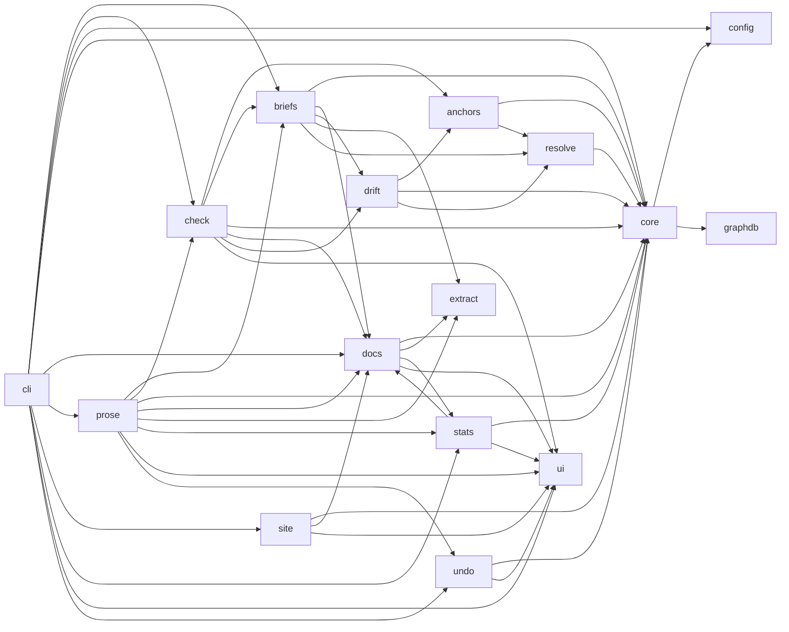

<!-- generated documentation — edit the source, not this file -->
# documate — architecture

Every subsystem on one page, in reading order: entry points (nothing imports them) first, then the machinery they drive. Each section is the subsystem's own prose, what it exposes, and how the pieces depend on each other; headings link to the full per-module reference under [`architecture/`](architecture/).

## [`src/documate/cli.py`](architecture/src.documate.cli.md)

cli.py — one command. Bare `documate` does the whole job; flags pick a mode.

  documate            index → write/refresh the docs → gate the result
  documate --check    gate only, writes nothing: generated docs fresh, anchors
                      real, no authored page lying about changed code (CI/hooks)
  documate --watch    keep running: regenerate whenever a tracked file changes
  documate --ai       the opt-in model layer: draft every missing docstring and
                      repair drifted pages via the claude CLI, then re-verify
                      through the gate (default model haiku; `--ai sonnet` upgrades)
  documate --stats    the dashboard: coverage bars, doc lines +/−, and the
                      all-time --ai bill (ledgers live next to the graph)

  documate --init     scaffold a documate.config.json (defaults, ready to edit),
                      then run the normal job — first-time setup in one command

Everything else is an override: `documate PATH` (or --root) points the same
binary at any repo or monorepo sub-tree, --base picks the drift ref, --full
re-indexes from scratch, --html adds the static site, --briefs emits work
orders whenever the gate runs. --only/--dry-run/--budget aim, preview, and
cap an --ai run; --undo reverts the last one from its recorded manifest;
--list-undocumented prints the missing-docs map as JSON. One Context per
invocation, no import-time globals. `--watch --ai` is refused: a model call
on every save is a token faucet — run --ai as a deliberate one-shot.

**depends on** [`src/documate/briefs.py`](architecture/src.documate.briefs.md), [`src/documate/check.py`](architecture/src.documate.check.md), [`src/documate/config.py`](architecture/src.documate.config.md), [`src/documate/core.py`](architecture/src.documate.core.md), [`src/documate/docs.py`](architecture/src.documate.docs.md), [`src/documate/prose.py`](architecture/src.documate.prose.md), [`src/documate/site.py`](architecture/src.documate.site.md), [`src/documate/stats.py`](architecture/src.documate.stats.md), [`src/documate/ui.py`](architecture/src.documate.ui.md), [`src/documate/undo.py`](architecture/src.documate.undo.md)

## [`src/documate/briefs.py`](architecture/src.documate.briefs.md)

briefs.py — O(diff) work orders for a prose-writing model (or a human).

`documate --briefs` turns the gate's findings into self-contained files an
LLM can act on without exploring the repo — the integration surface is *a file you
hand to a model*, never a server (see notes/v2-direction.md). Three kinds:

  drift         an authored page's anchored code changed: re-verify the prose,
                edit only what the change falsified, re-pin the sig.
  undocumented  a symbol changed vs --base and has no docstring/doc-comment:
                draft one.
  module        a file has no module-level prose (the architecture page's
                section lead) — seeding scope only, never diff-driven.

Each brief packs everything the task needs: the symbol's current source, the diff
vs base, the page as committed (drift kind), the docstrings of direct callers and
callees (how the thing is *used*), and what its tests assert. Undocumented briefs
are ordered callees-first so drafted summaries compose instead of being guessed.
A `briefs.json` index beside the briefs is the machine-readable half: the wrapper
reads it, feeds each brief to the model, then re-runs `documate --check` — the gate
itself is the verification loop. Emission is O(diff): a quiet repo writes an empty
index and nothing else. Stdlib only.

**depends on** [`src/documate/core.py`](architecture/src.documate.core.md), [`src/documate/docs.py`](architecture/src.documate.docs.md), [`src/documate/drift.py`](architecture/src.documate.drift.md), [`src/documate/extract.py`](architecture/src.documate.extract.md), [`src/documate/resolve.py`](architecture/src.documate.resolve.md)  ·  **used by** [`src/documate/check.py`](architecture/src.documate.check.md), [`src/documate/cli.py`](architecture/src.documate.cli.md), [`src/documate/prose.py`](architecture/src.documate.prose.md)

## [`src/documate/check.py`](architecture/src.documate.check.md)

check.py — `documate --check`: the one gate. Are the docs fresh, real, and honest?

Three checks behind one gate (CI and the pre-commit hook run exactly this):

  freshness  the generated tier matches what `documate` would write right now
             (regenerate in memory, diff against disk — no timestamps, no hashes)
  anchors    every `sym:` anchor in an authored page still resolves to real code
  drift      an authored page describes code that changed since --base but wasn't
             itself updated. DIRECT (the documented file changed) gates; RIPPLE
             (a dependency of the documented code changed) is advisory only.

Degrade contract: a missing graph never gates (the CLI indexes before calling in, so
this only bites on exotic setups); RIPPLE never gates. Exit 1 = a doc is stale, a doc
names a ghost, or a doc is lying. With --briefs the findings are additionally emitted
as work-order files (see `briefs`) — emission never changes the exit code. All
output goes through `ui` (rich); the logic is stdlib only.

**depends on** [`src/documate/anchors.py`](architecture/src.documate.anchors.md), [`src/documate/briefs.py`](architecture/src.documate.briefs.md), [`src/documate/core.py`](architecture/src.documate.core.md), [`src/documate/docs.py`](architecture/src.documate.docs.md), [`src/documate/drift.py`](architecture/src.documate.drift.md), [`src/documate/ui.py`](architecture/src.documate.ui.md)  ·  **used by** [`src/documate/cli.py`](architecture/src.documate.cli.md), [`src/documate/prose.py`](architecture/src.documate.prose.md)

## [`src/documate/config.py`](architecture/src.documate.config.md)

config.py — everything project-specific about the repo documate is pointed at.

documate's logic is repo-agnostic; this is where a given repo's specifics live, behind
neutral defaults plus an optional JSON override. A repo with the default layout
(docs under `docs/`, graph at `.documate/graph.db`) needs no config. Anything else
drops a `documate.config.json` and overrides only the keys it cares about. Search order:

    $DOCUMATE_CONFIG (absolute path)   ->  explicit, wins
    <root>/documate.config.json        ->  the conventional home
    <root>/.documate.config.json       ->  repo-root dotfile alternative

Keys (all optional; omitted keeps the default):

    docs_dir       where the docs live: generated pages are written here, authored
                   pages are scanned for anchors here                 ("docs")
    site_dir       where `docs --html` writes the static site (a build
                   artifact — gitignore it)                            ("site")
    graph_db       where the indexer writes its graph             (".documate/graph.db")
    skip_dirs      path substrings never treated as source-of-truth: not indexed,
                   no pages, no briefs (vendored/generated/build trees)
    test_markers   path substrings marking test code — directories ("/tests/") or
                   filename suffixes ("_test.go")  (prefer prod over these)

The two list keys EXTEND their defaults rather than replace them — adding your
one vendored tree must not cost you the stock list. Prefix an entry with `!` to
drop a default (`"!/vendor/"` un-skips vendor/).
    default_base   git ref `check` compares against                ("main")
    project_name   the name the generated pages carry (default: derived from the
                   checkout, worktree-safe via the git common dir)
    format_cmd     command --ai runs over the source files it touched, paths
                   appended ("clang-format -i"); None skips formatting

Unknown config keys are a hard error — a typo silently doing nothing is the exact rot
documate exists to stop. Stdlib only.

**exposes** `Config`, `load_config`  ·  **used by** [`src/documate/cli.py`](architecture/src.documate.cli.md), [`src/documate/core.py`](architecture/src.documate.core.md)

## [`src/documate/core.py`](architecture/src.documate.core.md)

core.py — the per-invocation Context: root + config + graph adapter.

A documate command runs against one repo (or one sub-tree of a monorepo). The CLI
resolves the root, loads its config, wires the graph adapter, and hands this Context to
every command. No import-time globals — the same process can point at different roots,
and nothing is hard-bound to one checkout.

**exposes** `Context`  ·  **depends on** [`src/documate/config.py`](architecture/src.documate.config.md), [`src/documate/graphdb.py`](architecture/src.documate.graphdb.md)  ·  **used by** [`src/documate/anchors.py`](architecture/src.documate.anchors.md), [`src/documate/briefs.py`](architecture/src.documate.briefs.md), [`src/documate/check.py`](architecture/src.documate.check.md), [`src/documate/cli.py`](architecture/src.documate.cli.md), [`src/documate/docs.py`](architecture/src.documate.docs.md), [`src/documate/drift.py`](architecture/src.documate.drift.md), [`src/documate/prose.py`](architecture/src.documate.prose.md), [`src/documate/resolve.py`](architecture/src.documate.resolve.md), [`src/documate/site.py`](architecture/src.documate.site.md), [`src/documate/stats.py`](architecture/src.documate.stats.md), [`src/documate/undo.py`](architecture/src.documate.undo.md)

## [`src/documate/docs.py`](architecture/src.documate.docs.md)

docs.py — `documate`: generate the committed documentation from code.

The generated tier. One overview page (`docs/README.md`) plus one architecture page per
subsystem (`docs/architecture/<slug>.md`), built from two honest sources:

  structure  the graph — which symbols exist, who calls whom, which module imports which
  prose      your docstrings/doc-comments, via `extract` — never invented

Output is committed (it's the documentation people read on the repo) but never
hand-edited: `documate` rewrites it, `documate --check` fails CI when it's stale.
A symbol with no docstring lands in an "Undocumented" fold instead of a faked
paragraph, so the coverage number on the overview is honest and ratchets up as you
write docstrings.

The build is split model -> render on purpose: `build_model` returns plain dataclasses
(no markdown), `render` turns them into markdown strings. A future HTML renderer plugs
into the same model. Output via `ui`, logic stdlib only; graph needed (the CLI
indexes before calling in).

**exposes** `Model`, `Page`, `_dir`, `_mermaid_lines`, `_slug`, `_tail`, `_tour`, `build_model`  ·  **depends on** [`src/documate/core.py`](architecture/src.documate.core.md), [`src/documate/extract.py`](architecture/src.documate.extract.md), [`src/documate/stats.py`](architecture/src.documate.stats.md), [`src/documate/ui.py`](architecture/src.documate.ui.md)  ·  **used by** [`src/documate/briefs.py`](architecture/src.documate.briefs.md), [`src/documate/check.py`](architecture/src.documate.check.md), [`src/documate/cli.py`](architecture/src.documate.cli.md), [`src/documate/prose.py`](architecture/src.documate.prose.md), [`src/documate/site.py`](architecture/src.documate.site.md), [`src/documate/stats.py`](architecture/src.documate.stats.md)

## [`src/documate/prose.py`](architecture/src.documate.prose.md)

prose.py — the opt-in model layer: drive Claude over the work orders.

documate itself never calls a model API; this module shells out to the `claude`
CLI (Haiku by default), feeding it one self-contained brief per finding and
letting it edit the repo directly. The gate is the verifier: after drafting,
docs regenerate and `check` re-runs — a draft that doesn't survive the gate is
a failure, not a doc. Two entry points, one per mode:

  fix_check  `documate --check --ai` — surgical, O(diff): re-verify drifted
             authored pages (re-pinning their sigs) and draft docstrings for
             changed-but-undocumented symbols.
  fix_docs   `documate --ai` — the fresh-repo seeding pass: draft a
             docstring for every undocumented symbol, callees first, then
             regenerate the pages from them.

Two drafting paths, chosen per work order. Undocumented symbols and modules in
Python and every doc-above comment language (Go, the C family, Rust, JS/TS,
shell, …) take the token-optimal batched path: one single-turn claude call per
_BATCH briefs, no tools — the model only outputs doc text in marked blocks, and
documate inserts each at the symbol's known line itself (one system-prompt
overhead per batch, zero Read/Edit turns). Drift repairs and anything else
keep the agentic path: one call per brief with Read+Edit, editing in place.
Either way a _Spend meter rides the run: exact tokens tick on the spinner as
the CLI streams usage, exact dollars settle from each call's result payload.

Guardrails: a hard per-call timeout, a per-run cap (_CAP — re-running resumes,
and the callees-first order makes iterative runs compose), and no commits —
drafts land as uncommitted edits for a human to review, which is also why the
layer can never trigger on its own output. The model dependency stays behind
the subprocess boundary; output goes through `ui` (a live progress bar on a
terminal, a plain transcript in CI).

**depends on** [`src/documate/briefs.py`](architecture/src.documate.briefs.md), [`src/documate/check.py`](architecture/src.documate.check.md), [`src/documate/core.py`](architecture/src.documate.core.md), [`src/documate/docs.py`](architecture/src.documate.docs.md), [`src/documate/extract.py`](architecture/src.documate.extract.md), [`src/documate/stats.py`](architecture/src.documate.stats.md), [`src/documate/ui.py`](architecture/src.documate.ui.md), [`src/documate/undo.py`](architecture/src.documate.undo.md)  ·  **used by** [`src/documate/cli.py`](architecture/src.documate.cli.md)

## [`src/documate/site.py`](architecture/src.documate.site.md)

site.py — `documate --html`: the same docs, rendered as a static site.

The second consumer of the model/render seam: `docs.build_model` builds one Model, and
this module renders it as HTML the way `docs.render` renders it as markdown — same
structure, same docstring prose, so the site can never say something the committed
pages don't. It adds two things the markdown tier can't carry: an overview and an
Architecture page as real, navigable HTML, and client-side search / theming / diagrams.

The output is a build artifact, not a third doc tier: it lands in `site_dir`
(gitignored, like the graph), is regenerated wholesale by `documate --html`, and
is NOT gated by `documate --check` — the committed markdown stays the single source the
gate protects. Host it like any static site (GitHub Pages, `python -m http.server`).
A `.nojekyll` marker ships alongside so GitHub Pages serves the files verbatim, and
every link is relative so the site works under a `user.github.io/repo/` subpath.

Self-contained: one stylesheet, one script, no build tooling, no framework. The only
network fetch is Mermaid from a CDN to draw the diagrams client-side; offline, the
flowchart text stays readable in its `<pre>`. Output via `ui`, logic stdlib only.

**depends on** [`src/documate/core.py`](architecture/src.documate.core.md), [`src/documate/docs.py`](architecture/src.documate.docs.md), [`src/documate/ui.py`](architecture/src.documate.ui.md)  ·  **used by** [`src/documate/cli.py`](architecture/src.documate.cli.md)

## [`src/documate/stats.py`](architecture/src.documate.stats.md)

stats.py — `documate --stats`: the documentation dashboard.

What the repo's documentation looks like right now (coverage bars, doc-line
counts, page sizes), how it moved (+/− deltas), and what the model layer has
cost so far. Two append-only jsonl ledgers next to the graph carry the
history: `stats.jsonl` gets a snapshot whenever a docs run or --stats sees
the numbers change, `spend.jsonl` gets one line per --ai run (prose appends
it even on Ctrl-C — spent tokens must never vanish from the bill). Reading
either ledger degrades: absent or garbled lines render as "no history yet",
never a crash — the dashboard is a viewer, not a gate.

**depends on** [`src/documate/core.py`](architecture/src.documate.core.md), [`src/documate/docs.py`](architecture/src.documate.docs.md), [`src/documate/ui.py`](architecture/src.documate.ui.md)  ·  **used by** [`src/documate/cli.py`](architecture/src.documate.cli.md), [`src/documate/docs.py`](architecture/src.documate.docs.md), [`src/documate/prose.py`](architecture/src.documate.prose.md)

## [`src/documate/ui.py`](architecture/src.documate.ui.md)

ui.py — one voice for everything documate says.

Every human-facing line the tool prints goes through here: a fixed glyph
vocabulary (✓ ok, ✗ fail, ! warn, → doing), consistent colors, a spinner for
the slow silent parts, and a live progress bar while the model layer drafts.
On a real terminal the output is dynamic and colored; captured or piped
(tests, CI, the pre-commit hook) the exact same words come out as plain
single-line text — rich resolves sys.stdout/stderr lazily and drops styling
for non-terminals, and soft_wrap keeps messages greppable at any width.

Stream contract is preserved from the print() era: successes and advisories
go to stdout, gate failures to stderr — CI redirects keep meaning.

**used by** [`src/documate/check.py`](architecture/src.documate.check.md), [`src/documate/cli.py`](architecture/src.documate.cli.md), [`src/documate/docs.py`](architecture/src.documate.docs.md), [`src/documate/prose.py`](architecture/src.documate.prose.md), [`src/documate/site.py`](architecture/src.documate.site.md), [`src/documate/stats.py`](architecture/src.documate.stats.md), [`src/documate/undo.py`](architecture/src.documate.undo.md)

## [`src/documate/undo.py`](architecture/src.documate.undo.md)

undo.py — the --ai run manifest, and `documate --undo` to revert it.

Model output is indistinguishable from hand-written prose once it lands, which is
what makes reviewing (and unpicking) a big run slow. Two answers, neither of which
marks the files themselves — nothing documate writes into a repo names the tool:

  record   every --ai run leaves `.documate/last-run.json`: mode, model, which
           file:symbol pairs were drafted, and per touched file the full
           before-text plus a hash of what the run left behind.
  undo     `documate --undo` restores each recorded file's before-text — but only
           when its current content still hashes to what the run left. A file
           edited since is refused, file by file, and stays in the manifest; git
           remains the real undo once drafts are committed, this one works before
           any commit exists.

Records from the same process merge (bare `--ai` chains a seeding pass into a
repair pass — one invocation, one manifest); a new invocation replaces the
manifest, so `--undo` always means "the last `--ai` run". Stdlib only.

**depends on** [`src/documate/core.py`](architecture/src.documate.core.md), [`src/documate/ui.py`](architecture/src.documate.ui.md)  ·  **used by** [`src/documate/cli.py`](architecture/src.documate.cli.md), [`src/documate/prose.py`](architecture/src.documate.prose.md)

## [`src/documate/drift.py`](architecture/src.documate.drift.md)

drift.py — flag docs that describe code which just changed.

The engine behind `check`'s third gate. The anchor index says which authored page
documents which symbol; the resolver maps each anchor to its file; git says what
changed. Intersect: a documented file changed but its page didn't → the prose may now
be lying.

    changed = (branch vs base) ∪ (working tree + staged)

Two tiers:
  DIRECT  the documented *symbol's* code changed. Gates.
  RIPPLE  the documented symbol didn't change, but it calls a symbol defined in a file
          that did (graph-backed, bounded). Advisory only — never gates, silent without
          a graph. A weaker signal shouldn't block a push.

Both tiers share ONE oracle: an AST fingerprint of the symbol's source (formatting-
invariant, literal-sensitive — see `fingerprint`). A sig-less anchor compares that
fingerprint between the merge-base and the working tree, so pure formatter churn and
edits to *other* symbols in the same file never flag — only the documented symbol
changing does. An anchor pinned with `sig:` compares the same fingerprint against an
author-verified value instead of the base, and a mismatch is DIRECT drift whose message
carries the current sig so the author can re-verify the prose and re-pin. The idea is
fiberplane/drift's AST fingerprint; the sig lives inline in the anchor, not a lock file.

git supplies the cheap pre-filter (which files differ from base) and the base blob;
the gate *decision* for sig-less anchors is the fingerprint compare, not file
membership. `sym:` needs the graph and degrades without it. Stdlib only.

**depends on** [`src/documate/anchors.py`](architecture/src.documate.anchors.md), [`src/documate/core.py`](architecture/src.documate.core.md), [`src/documate/resolve.py`](architecture/src.documate.resolve.md)  ·  **used by** [`src/documate/briefs.py`](architecture/src.documate.briefs.md), [`src/documate/check.py`](architecture/src.documate.check.md)

## [`src/documate/extract.py`](architecture/src.documate.extract.md)

extract.py — pull the prose out of source, per language.

The prose in the generated docs is the doc you already wrote next to the code — never
invented. Python docstrings come via stdlib `ast`; everything else (C/C++/Go/Rust/JS/TS/
Java/...) via the doc-comment block above each symbol (the graph hands us the line,
source hands us the comment), plus the file-top comment block as the module's lead prose. It's the same leading `//`/`/** */` convention doxygen and
friends read, lifted with string ops — no external doc tool to install. Stdlib only.

**used by** [`src/documate/briefs.py`](architecture/src.documate.briefs.md), [`src/documate/docs.py`](architecture/src.documate.docs.md), [`src/documate/prose.py`](architecture/src.documate.prose.md)

## [`src/documate/resolve.py`](architecture/src.documate.resolve.md)

resolve.py — turn a doc anchor into the concrete code it names, or fail loudly.

A doc module declares what code it describes with anchors. This resolves one anchor to
its real target, or fails when the target is gone (renamed/deleted = the doc now lies).
Keystone the anchor validation and the drift gate both hang off.

One namespace:

  sym:NAME              a function/class, resolved against the graph (via the adapter).
  sym:NAME@repo/rel.c   ~10% of names collide; add @repo-rel-path to disambiguate.

`sym:` DEGRADES (soft pass) when the graph is absent/locked — you can't gate on an
ephemeral artifact. Stdlib only.

**exposes** `resolve`  ·  **depends on** [`src/documate/core.py`](architecture/src.documate.core.md)  ·  **used by** [`src/documate/anchors.py`](architecture/src.documate.anchors.md), [`src/documate/briefs.py`](architecture/src.documate.briefs.md), [`src/documate/drift.py`](architecture/src.documate.drift.md)

## [`src/documate/anchors.py`](architecture/src.documate.anchors.md)

anchors.py — scan authored docs for `documents:` anchors and validate them.

An authored page (hand-written markdown under docs/) declares what code it describes:

    <!-- documents: sym:unlock -->               (prose, invisible HTML comment)
    <!-- documents: sym:unlock sig:0f3a9c1b2d4e5f60 -->   (pinned to a fingerprint)
    %% documents: sym:ble_handler                 (inside a mermaid block)

`build_index` scans every .md under docs_dir into `{anchor: [pages]}` — graph-free and
deterministic, computed fresh each run (nothing to commit or keep in sync). Generated
pages carry no anchors (their freshness is checked by regeneration instead), so this
is effectively the authored tier's map. `validate` resolves each anchor to confirm the
code it names still exists; a sym: against a missing graph degrades to a warning.

A `sig:` token pins the *preceding* sym: to the fingerprint of the code the author
verified the prose against (drift prints the current value). With a sig, drift for
that page/anchor is decided by fingerprint comparison instead of file-level git diff —
per-symbol and base-ref-free. The sig lives inline in the anchor, never in a lock
file: it travels with the prose it protects and updates in the same edit.
Stdlib only.

**exposes** `scan`  ·  **depends on** [`src/documate/core.py`](architecture/src.documate.core.md), [`src/documate/resolve.py`](architecture/src.documate.resolve.md)  ·  **used by** [`src/documate/check.py`](architecture/src.documate.check.md), [`src/documate/drift.py`](architecture/src.documate.drift.md)

## [`src/documate/graphdb.py`](architecture/src.documate.graphdb.md)

graphdb.py — documate's only door to the code graph.

Wraps the indexing engine (`._engine`). Every other documate module talks to THIS,
never to the engine internals or the sqlite schema. Refactor or swap the engine and
only this file moves — that's the decoupling the whole layering is about.

Two halves:
  index()   drives the engine to (re)build the graph at config.graph_db.
  reads     name lookup / callees / reverse-deps over a read-only connection. Reads
            DEGRADE: a missing or locked db returns empty, never raises — a sym: check
            soft-passes when the graph isn't there. It's an ephemeral artifact; never
            gate on its absence.

The sqlite schema (nodes: name/kind/qualified_name/file_path/line_start; edges:
kind/source_qualified/target_qualified) is referenced ONLY here.

**exposes** `GraphDB`  ·  **used by** [`src/documate/core.py`](architecture/src.documate.core.md)

## [`scripts/coverage_report.py`](architecture/scripts.coverage_report.md)

coverage_report.py — render coverage.py JSON as a colored per-file table.

`make coverage` runs the suite under coverage.py, dumps JSON, and pipes the
path here: one row per source file — hue-coded percentage (green >= 80,
yellow >= 50, red below, dim zero), a 22-cell bar, covered/total statements —
grouped by directory, with a TOTAL line. Colors turn off when stdout isn't a
tty, so redirecting to a file stays clean. Stdlib only.

## [`src/documate/__init__.py`](architecture/src.documate.__init__.md)

documate — generate docs from your code and keep them honest.

One command: bare `documate` writes the documentation (structure from the code
graph, prose from your docstrings) and then gates it; `documate --check` runs the
gate alone for CI — failing when the docs go stale, name dead code, or lie about
code that changed. Repo-agnostic: plugs into any codebase via
an optional documate.config.json.

Public surface is the CLI; the modules (core, docs, check, anchors, resolve, drift,
extract, graphdb, config) are importable for embedding.
