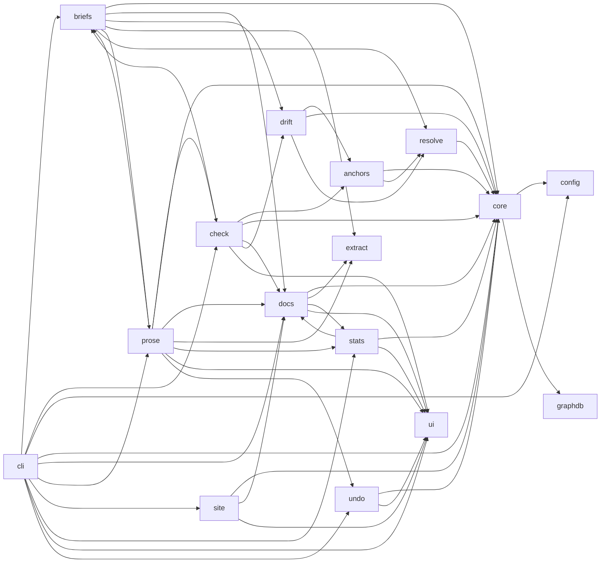

<!-- generated documentation — edit the source, not this file -->
# documate

**20 subsystems · 280/280 symbols documented (100%)**

**Start here:** [`src/documate/cli.py`](architecture/src.documate.cli.md) — the door into the codebase (nothing else imports it).

## Subsystems

| subsystem | about |
|---|---|
| [`scripts/coverage_report.py`](architecture/scripts.coverage_report.md) | coverage_report.py — render coverage.py JSON as a colored per-file table. |
| [`scripts/scan_hygiene.sh`](architecture/scripts.scan_hygiene.sh.md) | Hygiene gate for the built site: refuse to publish pages that leak local |
| [`scripts/scan_pii.sh`](architecture/scripts.scan_pii.sh.md) | Personal-info deny-list scan. The patterns arrive via $PII_PATTERNS (one |
| [`src/documate/__init__.py`](architecture/src.documate.__init__.md) | documate — generate docs from your code and keep them honest. |
| [`src/documate/anchors.py`](architecture/src.documate.anchors.md) | anchors.py — scan authored docs for `documents:` anchors and validate them. |
| [`src/documate/briefs.py`](architecture/src.documate.briefs.md) | briefs.py — O(diff) work orders for a prose-writing model (or a human). |
| [`src/documate/check.py`](architecture/src.documate.check.md) | check.py — `documate --check`: the one gate. Are the docs fresh, real, and honest? |
| [`src/documate/cli.py`](architecture/src.documate.cli.md) | cli.py — one command. Bare `documate` does the whole job; flags pick a mode. |
| [`src/documate/config.py`](architecture/src.documate.config.md) | config.py — everything project-specific about the repo documate is pointed at. |
| [`src/documate/core.py`](architecture/src.documate.core.md) | core.py — the per-invocation Context: root + config + graph adapter. |
| [`src/documate/docs.py`](architecture/src.documate.docs.md) | docs.py — `documate`: generate the committed documentation from code. |
| [`src/documate/drift.py`](architecture/src.documate.drift.md) | drift.py — flag docs that describe code which just changed. |
| [`src/documate/extract.py`](architecture/src.documate.extract.md) | extract.py — pull the prose out of source, per language. |
| [`src/documate/graphdb.py`](architecture/src.documate.graphdb.md) | graphdb.py — documate's only door to the code graph. |
| [`src/documate/prose.py`](architecture/src.documate.prose.md) | prose.py — the opt-in model layer: drive Claude over the work orders. |
| [`src/documate/resolve.py`](architecture/src.documate.resolve.md) | resolve.py — turn a doc anchor into the concrete code it names, or fail loudly. |
| [`src/documate/site.py`](architecture/src.documate.site.md) | site.py — `documate --html`: the same docs, rendered as a static site. |
| [`src/documate/stats.py`](architecture/src.documate.stats.md) | stats.py — `documate --stats`: the documentation dashboard. |
| [`src/documate/ui.py`](architecture/src.documate.ui.md) | ui.py — one voice for everything documate says. |
| [`src/documate/undo.py`](architecture/src.documate.undo.md) | undo.py — the --ai run manifest, and `documate --undo` to revert it. |

## Hotspots

*Mined from git history as of `bcbbf57`.*

**Most-changed:** [`src/documate/site.py`](architecture/src.documate.site.md) (5 commits), [`src/documate/briefs.py`](architecture/src.documate.briefs.md) (4 commits), [`src/documate/extract.py`](architecture/src.documate.extract.md) (4 commits), [`src/documate/prose.py`](architecture/src.documate.prose.md) (4 commits), [`src/documate/cli.py`](architecture/src.documate.cli.md) (3 commits).
