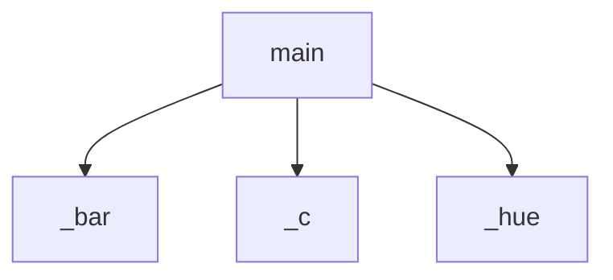

<!-- generated documentation — edit the source, not this file -->
# `scripts/coverage_report.py`

coverage_report.py — render coverage.py JSON as a colored per-file table.

`make coverage` runs the suite under coverage.py, dumps JSON, and pipes the
path here: one row per source file — hue-coded percentage (green >= 80,
yellow >= 50, red below, dim zero), a 22-cell bar, covered/total statements —
grouped by directory, with a TOTAL line. Colors turn off when stdout isn't a
tty, so redirecting to a file stays clean. Stdlib only.

## API

### `_c(code: str, s: str) -> str`
`scripts/coverage_report.py:18`

Wrap `s` in an ANSI color unless stdout is not a tty (pipes stay plain).

**called by** `_bar`, `main`

### `_hue(p: float) -> str`
`scripts/coverage_report.py:23`

The ANSI hue for a percentage: dim zero, green/yellow/red by threshold.

**called by** `_bar`, `main`

### `_bar(p: float) -> str`
`scripts/coverage_report.py:28`

A BARW-cell block bar, filled proportionally and colored by `_hue`.

**called by** `main`  ·  **calls** `_c`, `_hue`

### `main(argv: list[str]) -> int`
`scripts/coverage_report.py:34`

Read a coverage.py JSON report (argv[0]) and print the grouped table.

**calls** `_bar`, `_c`, `_hue`
