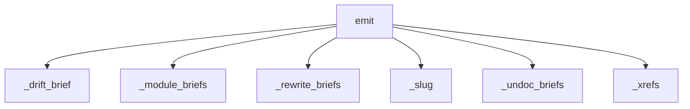

<!-- generated documentation — edit the source, not this file -->
# `src/documate/briefs.py`

briefs.py — O(diff) work orders for a prose-writing model (or a human).

`documate --briefs` turns the gate's findings into self-contained files an
LLM can act on without exploring the repo — the integration surface is *a file you
hand to a model*, never a server (see notes/v2-direction.md). Three kinds:

  drift         an authored page's anchored code changed: re-verify the prose,
                edit only what the change falsified, re-pin the sig.
  undocumented  a symbol changed vs --base and has no docstring/doc-comment:
                draft one.
  module        a file has no module-level prose (the architecture page's
                section lead) — seeding scope only, never diff-driven.

Each brief packs everything the task needs: the symbol's current source, the diff
vs base, the page as committed (drift kind), the docstrings of direct callers and
callees (how the thing is *used*), and what its tests assert. Undocumented briefs
are ordered callees-first so drafted summaries compose instead of being guessed.
A `briefs.json` index beside the briefs is the machine-readable half: the wrapper
reads it, feeds each brief to the model, then re-runs `documate --check` — the gate
itself is the verification loop. Emission is O(diff): a quiet repo writes an empty
index and nothing else. Stdlib only.

**depends on** [`src/documate/core.py`](src.documate.core.md), [`src/documate/docs.py`](src.documate.docs.md), [`src/documate/drift.py`](src.documate.drift.md), [`src/documate/extract.py`](src.documate.extract.md), [`src/documate/resolve.py`](src.documate.resolve.md)  ·  **used by** [`src/documate/check.py`](src.documate.check.md), [`src/documate/prose.py`](src.documate.prose.md)  ·  **discussed in** [`notes/v2-direction.md`](../../notes/v2-direction.md)

## API

### `_slug(text: str) -> str`
`src/documate/briefs.py:44`

A filename-safe slug for a page/symbol path (`docs/guides/a.md` -> `docs-guides-a.md`).

**called by** `emit`

### `_fence(lang: str, text: str) -> str`
`src/documate/briefs.py:49`

A 4-backtick fenced block — authored pages legitimately contain 3-backtick fences.

**called by** `_drift_brief`, `_rewrite_briefs`, `_undoc_briefs`

### `_span(ctx: Context, rel: str, a, b) -> str | None`
`src/documate/briefs.py:54`

The symbol's current source (1-indexed inclusive lines), capped at _SRC_CAP;
None when the span can't be read — the brief then simply omits the section.

**called by** `_drift_brief`, `_rewrite_briefs`, `_undoc_briefs`

### `_diff(ctx: Context, base: str, rel: str) -> str | None`
`src/documate/briefs.py:69`

Unified diff of `rel` vs merge-base(base, HEAD) — branch delta plus uncommitted,
same change window drift uses. None when git has nothing (a sig can drift with no
diff vs base: the code changed long ago, the pin is older still).

**called by** `_drift_brief`, `_undoc_briefs`

### `_xrefs(ctx: Context) -> tuple[dict, dict]`
`src/documate/briefs.py:80`

(callers, callees) keyed by engine-qualified name, qualified endpoints only —
a bare target is an unresolved/stdlib call and matching it by short name
conflates collisions (same rule as the docs pages' xref maps).

**called by** `emit`

### `_doc_of(ctx: Context, qualified: str) -> str | None`
`src/documate/briefs.py:93`

First line of one symbol's docstring, by engine-qualified name; None when it
has none. Quoted in a brief's used-by section so the model sees the contract of
each neighbor, not its whole body.

**called by** `_used`

### `_used(ctx: Context, qualified: str, callers: dict, callees: dict) -> list[str]`
`src/documate/briefs.py:112`

The used-by bullet lines for one symbol: direct callers then callees, each
with its doc's first line when it has one. Empty when the graph knows nothing.

**called by** `_tail_sections`  ·  **calls** `_doc_of`

### `_tail_sections(ctx: Context, qualified: str, xrefs: tuple, tested: dict) -> list[str]`
`src/documate/briefs.py:126`

The shared trailing sections of every brief: how the symbol is used, and what
its tests assert — evidence sections, omitted entirely when empty.

**called by** `_drift_brief`, `_rewrite_briefs`, `_undoc_briefs`  ·  **calls** `_used`

### `_abs_q(ctx: Context, tgt: dict) -> str`
`src/documate/briefs.py:143`

A resolve target's engine-qualified (absolute-path) name, for the xref maps.

**called by** `_drift_brief`

### `_drift_brief(ctx: Context, base: str, row: dict, xrefs: tuple, tested: dict) -> tuple[str, dict] | None`
`src/documate/briefs.py:150`

One drift work order (text, index row) from a DIRECT drift row, or None when
the anchor no longer resolves (the anchors gate owns that failure).

**called by** `emit`  ·  **calls** `_abs_q`, `_diff`, `_fence`, `_span`, `_tail_sections`

### `_bottom_up(rows: list[dict], callees: dict) -> list[dict]`
`src/documate/briefs.py:207`

Order changed symbols callees-first, so a caller's brief is drafted after the
summaries it composes over already exist. Cycles break deterministically.

**called by** `_undoc_briefs`

### `_no_doc(ctx: Context, rows: list[dict]) -> list[dict]`
`src/documate/briefs.py:230`

The subset of symbol rows that carry no docstring/doc-comment, checked
per file through the same extractor the docs pages read.

**called by** `_undoc_briefs`

### `_undoc_briefs(ctx: Context, base: str, xrefs: tuple, tested: dict, scope: str) -> list[tuple[str, dict]]`
`src/documate/briefs.py:246`

(text, index row) per undocumented Function/Class — the 'make documentation'
half. scope='changed' keys on the diff vs base (`check --fix`, O(diff));
scope='all' walks every graph symbol (`docs --fix`, the fresh-repo seeding
pass, where a diff section would be noise and is omitted). Empty without a
graph.

**called by** `emit`  ·  **calls** `_bottom_up`, `_diff`, `_fence`, `_no_doc`, `_span`, `_tail_sections`

### `_rewrite_briefs(ctx: Context, xrefs: tuple, tested: dict) -> list[tuple[str, dict]]`
`src/documate/briefs.py:315`

(text, index row) per C-family Function/Class — the `--rewrite` scope. Every
C/C++ symbol gets a work order to (re)write its doc comment as Doxygen: the
current doc (when any) and the source are quoted so the model improves on what's
there rather than inventing. Rows sort by (file, line) so the inserter, running a
file's symbols top-to-bottom, keeps its line-shift bookkeeping coherent. Empty
without a graph or without C sources.

**called by** `emit`  ·  **calls** `_fence`, `_span`, `_tail_sections`

### `_module_briefs(ctx: Context) -> list[tuple[str, dict]]`
`src/documate/briefs.py:374`

(text, index row) per module with no module-level prose — the top-of-file
doc each architecture-page section leads with. Seeding-scope only: module
prose is repo furniture, not diff work, so the check path never drafts it.
These sort after the symbol orders, so in a batched prompt the model has
just written the file's docstrings when it summarizes the file.

**called by** `emit`

### `emit(ctx: Context, base: str, direct: list[dict], out_dir: Path, undocumented: str='changed', rewrite: bool=False) -> list[dict]`
`src/documate/briefs.py:439`

Write one work-order file per finding into `out_dir` plus a `briefs.json`
index (the machine-readable half), clearing briefs from earlier runs first so a
fixed finding can't linger as stale work. `undocumented` picks the doc-drafting
scope: 'changed' (vs base — the check path) or 'all' (every graph symbol — the
fresh-repo seeding path). `rewrite` swaps all of that for the C-family rewrite
scope: one work order per C/C++ symbol to re-emit its doc comment as Doxygen.
Returns the index rows; a green repo returns [] and the directory holds only an
empty index — the wrapper's definitive 'nothing to do'.

**calls** `_drift_brief`, `_module_briefs`, `_rewrite_briefs`, `_slug`, `_undoc_briefs`, `_xrefs`
