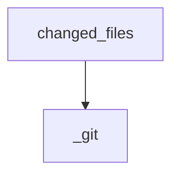

<!-- generated by `documate docs` — edit the source, not this file -->
# `src/documate/drift.py`

drift.py — flag docs that describe code which just changed.

The engine behind `check`'s third gate. The anchor index says which authored page
documents which symbol; the resolver maps each anchor to its file; git says what
changed. Intersect: a documented file changed but its page didn't → the prose may now
be lying.

    changed = (branch vs base) ∪ (working tree + staged)

Two tiers:
  DIRECT  the documented file itself changed. Gates.
  RIPPLE  the documented file didn't change, but it calls a symbol defined in one that
          did (graph-backed, bounded). Advisory only — never gates, silent without a
          graph. A weaker signal shouldn't block a push.

git is the change oracle for sig-less anchors — no stored hashes. An anchor pinned
with `sig:` opts out of git entirely: its verdict is a fingerprint comparison against
the symbol's current source (per-symbol, base-ref-free, indifferent to unrelated edits
in the same file), and a mismatch is DIRECT drift whose message carries the current
sig so the author can re-verify the prose and re-pin. The idea is fiberplane/drift's
AST fingerprint; the sig lives inline in the anchor instead of a lock file.
`sym:` needs the graph and degrades without it. Stdlib only.

**depends on** [`src/documate/anchors.py`](src.documate.anchors.md), [`src/documate/core.py`](src.documate.core.md), [`src/documate/resolve.py`](src.documate.resolve.md)  ·  **used by** [`src/documate/briefs.py`](src.documate.briefs.md), [`src/documate/check.py`](src.documate.check.md)

## API

### `fingerprint(ctx: Context, rel: str, line_start, line_end) -> str | None`
`src/documate/drift.py:36`

16-hex fingerprint of a symbol's source span, whitespace-run-insensitive.

Collapsing whitespace runs makes re-indents and re-wraps hash-stable while
keeping token boundaries, so `"a  b"` inside a string still differs from
`"a b"`. Spacing-only formatter churn (`x=1` -> `x = 1`) does flag — the
tool over-flags rather than silently passes a lying doc; a true syntax-tree
hash at index time is the upgrade path. None when the span can't be read
(caller degrades to a note, never gates on a broken oracle).

**called by** `find_drift`

### `_git(ctx: Context, *args: str) -> list[str]`
`src/documate/drift.py:59`

Run git against the repo root, returning non-blank stdout lines (empty on error).

**called by** `changed_files`

### `changed_files(ctx: Context, base: str) -> set[str]`
`src/documate/drift.py:67`

Repo-relative paths differing from `base`: branch delta ∪ uncommitted.

**called by** `find_drift`  ·  **calls** `_git`

### `dependent_files(ctx: Context, changed_rel: set[str], hops: int, cap: int) -> tuple[set[str], bool]`
`src/documate/drift.py:78`

Files whose symbols (up to `hops`) call/reference a symbol defined in a changed
file — the ripple set. Bounded by hops + cap with a truncated flag. Empty + False
without a graph (ripple degrades to nothing, never blocks).

**called by** `find_drift`

### `_collapse(rows: list[dict]) -> list[dict]`
`src/documate/drift.py:122`

Dedup drift rows to one per (page, file) pair, sorted by page.

**called by** `find_drift`

### `find_drift(ctx: Context, base: str, ripple_hops: int, ripple_cap: int)`
`src/documate/drift.py:133`

Return (direct rows, ripple rows, notes, truncated), deduped by (page, file).

**calls** `_collapse`, `changed_files`, `dependent_files`, `fingerprint`
