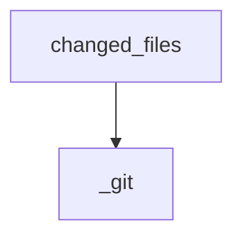

<!-- generated documentation — edit the source, not this file -->
# `src/documate/drift.py`

drift.py — flag docs that describe code which just changed.

The engine behind `check`'s third gate. The anchor index says which authored page
documents which symbol; the resolver maps each anchor to its file; git says what
changed. Intersect: a documented file changed but its page didn't → the prose may now
be lying.

    changed = (branch vs base) ∪ (working tree + staged)

Two tiers:
  DIRECT  the documented *symbol's* code changed. Gates.
  RIPPLE  the documented symbol didn't change, but it calls a symbol defined in a file
          that did (graph-backed, bounded). Advisory only — never gates, silent without
          a graph. A weaker signal shouldn't block a push.

Both tiers share ONE oracle: an AST fingerprint of the symbol's source (formatting-
invariant, literal-sensitive — see `fingerprint`). A sig-less anchor compares that
fingerprint between the merge-base and the working tree, so pure formatter churn and
edits to *other* symbols in the same file never flag — only the documented symbol
changing does. An anchor pinned with `sig:` compares the same fingerprint against an
author-verified value instead of the base, and a mismatch is DIRECT drift whose message
carries the current sig so the author can re-verify the prose and re-pin. The idea is
fiberplane/drift's AST fingerprint; the sig lives inline in the anchor, not a lock file.

git supplies the cheap pre-filter (which files differ from base) and the base blob;
the gate *decision* for sig-less anchors is the fingerprint compare, not file
membership. `sym:` needs the graph and degrades without it. Stdlib only.

**depends on** [`src/documate/anchors.py`](src.documate.anchors.md), [`src/documate/core.py`](src.documate.core.md), [`src/documate/resolve.py`](src.documate.resolve.md)  ·  **used by** [`src/documate/briefs.py`](src.documate.briefs.md), [`src/documate/check.py`](src.documate.check.md)

## API

### `fingerprint(ctx: Context, rel: str, line_start, line_end) -> str | None`
`src/documate/drift.py:40`

16-hex AST fingerprint of the symbol spanning lines `line_start..line_end` of `rel`.

Reads the working-tree file, slices the span, and hands it to the graph adapter,
which parses it with the indexing engine and serialises the syntax tree. The digest
is invariant to reindentation, re-wrapping, blank lines, trailing whitespace, and
spacing-only edits (`x=1` == `x = 1`, `f( a,b )` == `f(a, b)`), but sensitive to
signatures, control flow, operators, called names, and the exact contents of
string/char/numeric literals (`"a  b"` != `"a b"`, `1_000` != `1000`). A comment-only
edit does NOT change it (the engine drops comment/trivia nodes by default). None when
the span can't be read or parsed — the caller degrades to a note and never gates on a
broken oracle.

Same 16-hex shape as before, so committed `sig:` pins keep their *format*. The
algorithm changed (was a whitespace-collapsed line hash, which both over-flagged
`x=1`->`x = 1` and silently missed edits inside string literals), so existing pin
*values* changed once — re-pin from the sig `documate --check` prints.

**called by** `_symbol_drifted`, `find_drift`

### `_git(ctx: Context, *args: str) -> list[str]`
`src/documate/drift.py:71`

Run git against the repo root, returning non-blank stdout lines (empty on error).

**called by** `_merge_base`, `changed_files`

### `_merge_base(ctx: Context, base: str) -> str`
`src/documate/drift.py:79`

The base<->HEAD merge-base — the "before" snapshot the change set diffs against,
and where the sig-less fingerprint compare reads the symbol's old source. Falls back
to HEAD when there is no merge-base (base is an ancestor of / equals HEAD).

**called by** `find_drift`  ·  **calls** `_git`

### `_show(ctx: Context, ref: str, rel: str) -> bytes | None`
`src/documate/drift.py:87`

Raw bytes of `rel` at `ref` (`git show ref:rel`), or None when it didn't exist
there (a file newly added since base) or git errors.

**called by** `_symbol_drifted`

### `changed_files(ctx: Context, base: str) -> set[str]`
`src/documate/drift.py:96`

Repo-relative paths differing from `base`: branch delta ∪ uncommitted.

**called by** `find_drift`  ·  **calls** `_git`

### `dependent_files(ctx: Context, changed_rel: set[str], hops: int, cap: int) -> tuple[set[str], bool]`
`src/documate/drift.py:107`

Files whose symbols (up to `hops`) call/reference a symbol defined in a changed
file — the ripple set. Bounded by hops + cap with a truncated flag. Empty + False
without a graph (ripple degrades to nothing, never blocks).

**called by** `find_drift`

### `_collapse(rows: list[dict]) -> list[dict]`
`src/documate/drift.py:151`

Dedup drift rows to one per (page, file) pair, sorted by page.

**called by** `find_drift`

### `_symbol_drifted(ctx: Context, mb: str, base: str, rel: str, name, line, line_end, anchor: str, notes: list[str]) -> bool`
`src/documate/drift.py:162`

Did the documented symbol's code change between `mb` and the working tree?

Compares the symbol's AST fingerprint on each side: the working span (by its current
line range) against the same symbol located *by name* in the base blob (line-shift
proof). Formatter-only churn and edits to other symbols in the file therefore don't
flag. Degrades to a note (returns False) when either side can't be read/parsed — a
broken oracle never gates.

**called by** `find_drift`  ·  **calls** `_show`, `fingerprint`

### `find_drift(ctx: Context, base: str, ripple_hops: int, ripple_cap: int)`
`src/documate/drift.py:199`

Return (direct rows, ripple rows, notes, truncated), deduped by (page, file).

**calls** `_collapse`, `_merge_base`, `_symbol_drifted`, `changed_files`, `dependent_files`, `fingerprint`
