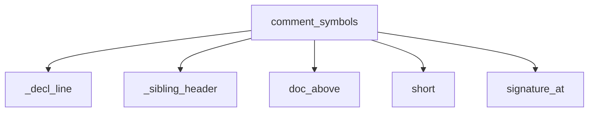

<!-- generated documentation — edit the source, not this file -->
# `src/documate/extract.py`

extract.py — pull the prose out of source, per language.

The prose in the generated docs is the doc you already wrote next to the code — never
invented. Python docstrings come via stdlib `ast`; everything else (C/C++/Go/Rust/JS/TS/
Java/...) via the doc-comment block above each symbol (the graph hands us the line,
source hands us the comment), plus the file-top comment block as the module's lead prose. It's the same leading `//`/`/** */` convention doxygen and
friends read, lifted with string ops — no external doc tool to install. Stdlib only.

**used by** [`src/documate/briefs.py`](src.documate.briefs.md), [`src/documate/docs.py`](src.documate.docs.md), [`src/documate/prose.py`](src.documate.prose.md)  ·  **discussed in** [`notes/v2-direction.md`](../../notes/v2-direction.md)

## API

### `short(qualified: str) -> str`
`src/documate/extract.py:17`

The bare symbol name at the tail of a `path::name` qualified name.

**called by** `comment_symbols`

### `py_symbols(path: Path) -> dict`
`src/documate/extract.py:22`

{dotted name: (signature, docstring|None)} for every def/class in a Python file.

Keys mirror the graph's qualified-name tails: a method is `Class.method` (so two
classes with an `__init__` don't clobber each other's docstring), a def nested in a
def stays bare — exactly how the engine qualifies them. The signature is rebuilt
from the AST (the graph doesn't store one) and carries the same dotted name; the
docstring is read straight from source — that's the truth the reference hangs off.

**called by** `extract`  ·  **calls** `visit`

### `visit(node, prefix: str) -> None`
`src/documate/extract.py:36`

Walk children; only a ClassDef extends the dotted prefix for its members.

**called by** `py_symbols`

### `doc_above(lines: list[str], decl_idx: int, hash_ok: bool=False) -> str | None`
`src/documate/extract.py:60`

The doc-comment block sitting immediately above a declaration (0-indexed line).

Harvests a contiguous `//` / `///` / `//!` run or a `/* ... */` / `/** ... */` block —
the convention every C-family / Go / Rust / JS-TS doc tool reads — skipping annotation
and attribute lines (`@Override`, `#[inline]`) that wedge between the comment and the
decl. With `hash_ok` (shell files, where `#` would otherwise be a directive) a `#` run
counts too, minus the shebang and minus letter-free ASCII-art banner lines.
A blank line breaks the claim (godoc/rustdoc/JSDoc all require adjacency —
a blank-separated comment is the file's, not the symbol's; see `module_doc`).
Markers stripped. None when there's nothing up there. Heuristic, not a parser:
the graph already told us *where* the symbol is, so this is just "read the lines above".

**called by** `_decl_line`, `comment_symbols`, `module_doc`

### `signature_at(lines: list[str], idx: int) -> str | None`
`src/documate/extract.py:119`

The full declaration starting at line `idx` (0-indexed), rejoined when it wraps.

Skips leading attribute lines (`@discardableResult`, `#[inline]` — the graph often
points at them, not the decl), then reads until the parameter parens balance,
cutting the body (`{`) or a C prototype's `;` off. Capped at 8 lines: a signature
is a signature, not a file.

**called by** `comment_symbols`

### `_sibling_header(path: Path) -> list[str]`
`src/documate/extract.py:171`

Lines of the header next to a C/C++/ObjC implementation file, [] when none.

C splits declaration from definition and the doc usually sits on the header
prototype, so a doc-less definition gets one more place to look — doxygen's
decl/def merge, done with string ops.

**called by** `comment_symbols`

### `_decl_line(lines: list[str], name: str, kind: str, avoid: int=-1) -> int | None`
`src/documate/extract.py:189`

The line index of another *documented* declaration of `name`, or None.

The doc a reader wrote isn't always above the node the graph kept: C documents
the header prototype, not the definition, and Swift's `extension Foo` can shadow
`class Foo` (one node per qualified name). Functions match `name(`, types match a
type keyword + name; comment lines never match (prose mentioning the name isn't a
declaration), and `avoid` excludes the node's own line.

**called by** `comment_symbols`  ·  **calls** `doc_above`

### `comment_symbols(path: Path, syms: list) -> dict`
`src/documate/extract.py:210`

{dotted name: (signature, doc|None)} for a non-Python file: the graph gives each
symbol's line, source gives the declaration (`signature_at`) and the comment above
it (the doc). Keyed by the qualified-name tail (`Cart.total`, like `py_symbols`) so
same-named methods on two classes keep their own docs.

Unlike `py_symbols` (docstring lives *inside* the def) these languages put the doc
*above*, so we lean on `line` from the graph rather than re-parsing the file. When
nothing sits above the node's line, the doc may still exist somewhere else the
author legitimately put it: on another declaration of the same name in this file
(Swift class vs extension), or on the prototype in the sibling header (C) — both
checked via `_decl_line` before giving up.

**called by** `extract`  ·  **calls** `_decl_line`, `_sibling_header`, `doc_above`, `short`, `signature_at`

### `extract(path: Path, syms: list) -> dict`
`src/documate/extract.py:252`

Per-language doc extraction: Python through stdlib `ast`, everything else through the
comment-above-declaration harvester. The one place that knows a file's language.

**calls** `comment_symbols`, `py_symbols`

### `module_doc(path: Path, first_line: int | None=None) -> str | None`
`src/documate/extract.py:266`

The module-level prose of a file: Python's module docstring; any other language's
comment block at the top of the file (Go's `// Package x ...`, a doxygen `@file`
header, a shell script's `#` header, a licence-free lead comment).

Two disambiguations. A copyright/license/SPDX block is boilerplate, not prose —
skipped, and the next comment block gets its turn. And a top comment sitting
*directly above* the first symbol (`first_line`, 1-indexed, from the graph) is
that symbol's doc — `doc_above` will claim it — so it is not also the module's.
Anything else blank-separated from the code below it is module prose.

**calls** `doc_above`
