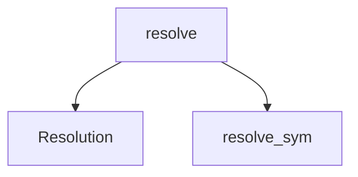

<!-- generated by `documate docs` — edit the source, not this file -->
# `src/documate/resolve.py`

resolve.py — turn a doc anchor into the concrete code it names, or fail loudly.

A doc module declares what code it describes with anchors. This resolves one anchor to
its real target, or fails when the target is gone (renamed/deleted = the doc now lies).
Keystone the anchor validation and the drift gate both hang off.

One namespace:

  sym:NAME              a function/class, resolved against the graph (via the adapter).
  sym:NAME@repo/rel.c   ~10% of names collide; add @repo-rel-path to disambiguate.

`sym:` DEGRADES (soft pass) when the graph is absent/locked — you can't gate on an
ephemeral artifact. Stdlib only.

**depends on** [`src/documate/core.py`](src.documate.core.md)  ·  **used by** [`src/documate/anchors.py`](src.documate.anchors.md), [`src/documate/briefs.py`](src.documate.briefs.md), [`src/documate/drift.py`](src.documate.drift.md)

## API

### `class Resolution`
`src/documate/resolve.py:28`

Outcome of resolving one anchor.

ok        resolved to exactly what it should.
degraded  a sym: couldn't be verified (graph absent/locked) — soft pass, never a
          real failure.
targets   the concrete code named (repo-relative).
error     one-line reason when ok is False.

**called by** `resolve`, `resolve_sym`

### `_skip(ctx: Context, path: str) -> bool`
`src/documate/resolve.py:46`

True when a resolved path sits in a skip_dir — never source-of-truth for an anchor.

**called by** `resolve_sym`

### `resolve_sym(ctx: Context, value: str) -> Resolution`
`src/documate/resolve.py:51`

Resolve a sym: anchor through the graph; soft-pass (degraded) when the graph is absent or locked.

**called by** `resolve`  ·  **calls** `Resolution`, `_skip`

### `resolve(ctx: Context, anchor: str) -> Resolution`
`src/documate/resolve.py:110`

Resolve one sym: anchor, or fail on unknown syntax.

**called by** `resolve_many`  ·  **calls** `Resolution`, `resolve_sym`

### `resolve_many(ctx: Context, anchors) -> list[Resolution]`
`src/documate/resolve.py:118`

Resolve a batch of anchors, preserving order.

**calls** `resolve`
