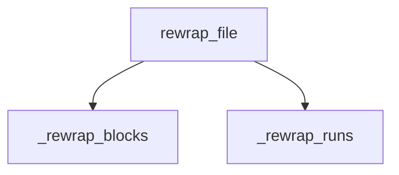

<!-- generated documentation — edit the source, not this file -->
# `src/documate/rewrap.py`

rewrap.py — reflow doc comments already in the source to `doc_width`.

`documate --rewrap-docs` is the no-model half of the wrapping story. `--ai` wraps
what it writes, but docs drafted by an earlier version (or by hand, or by another
tool) sit there one long line each, and a repo with a column limit rejects them.
This pass fixes them with pure text work: no model, no tokens, no network.

Only a doc comment carrying a line over the limit is touched — one already
inside it comes out byte-identical, so a sweep can't quietly reformat a repo's
hand-written prose. Two shapes are understood, the same two `prose` writes:
a `/** ... */` block (C family) and a run of line comments (`//`, `--`, `#`).
A Lua `--[[ long comment ]]` ends a run rather than joining it: reflowing one
would move its delimiters. The pass is idempotent, and every write goes into the
run manifest, so `documate --undo` takes it back. Stdlib only.

**depends on** [`src/documate/core.py`](src.documate.core.md), [`src/documate/docs.py`](src.documate.docs.md), [`src/documate/extract.py`](src.documate.extract.md), [`src/documate/prose.py`](src.documate.prose.md), [`src/documate/ui.py`](src.documate.ui.md), [`src/documate/undo.py`](src.documate.undo.md)  ·  **used by** [`src/documate/cli.py`](src.documate.cli.md)

## API

### `_fits(span: list[str], width: int) -> bool`
`src/documate/rewrap.py:27`

True when every line already fits — tabs counted as the 8 columns a format
gate counts them as, not as one character.

**called by** `_rewrap_blocks`, `_rewrap_runs`

### `_room(ind: str, width: int, lead: int) -> int`
`src/documate/rewrap.py:33`

Columns left for text after the indentation and a `lead`-wide marker.

**called by** `_rewrap_blocks`, `_rewrap_runs`

### `_blocks(lines: list[str]) -> list[tuple[int, int]]`
`src/documate/rewrap.py:38`

(start, end) of every `/** ... */` doc block, 0-indexed inclusive.

**called by** `_rewrap_blocks`

### `_in_run(stripped: str, prefix: str) -> bool`
`src/documate/rewrap.py:55`

True when the line continues a line-comment doc run. A Lua long-comment
opener ends the run instead of joining it.

**called by** `_runs`

### `_runs(lines: list[str], prefix: str) -> list[tuple[int, int]]`
`src/documate/rewrap.py:61`

(start, end) of every contiguous line-comment run, 0-indexed inclusive.

**called by** `_rewrap_runs`  ·  **calls** `_in_run`

### `_rewrap_blocks(lines: list[str], width: int) -> int`
`src/documate/rewrap.py:77`

Reflow every over-long `/** */` block in place. Returns how many changed.

**called by** `rewrap_file`  ·  **calls** `_blocks`, `_fits`, `_room`

### `_rewrap_runs(lines: list[str], width: int, prefix: str) -> int`
`src/documate/rewrap.py:103`

Reflow every over-long line-comment run in place. Returns how many changed.

**called by** `rewrap_file`  ·  **calls** `_fits`, `_room`, `_runs`

### `rewrap_file(path: Path, width: int) -> tuple[str | None, int]`
`src/documate/rewrap.py:120`

(new text, comments changed) for one file; (None, 0) when it can't be read
or nothing overflows — an unreadable file is skipped, never half-written.

**called by** `run`  ·  **calls** `_rewrap_blocks`, `_rewrap_runs`

### `run(ctx: Context, only: str | None=None, dry: bool=False) -> int`
`src/documate/rewrap.py:140`

`documate --rewrap-docs`: reflow over-long doc comments in every tracked
source file documate would document, then regenerate the pages the change
moves. `only` narrows to a file glob, `dry` reports without writing. Always
exit 0 — nothing here can fail a build; a repo with nothing to reflow says so
and stops.

**calls** `rewrap_file`
