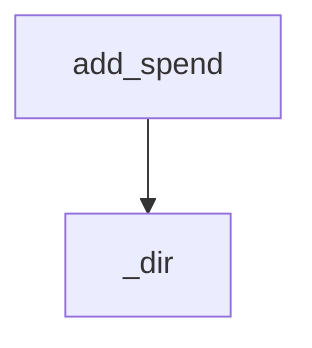

<!-- generated documentation — edit the source, not this file -->
# `src/documate/stats.py`

stats.py — `documate --stats`: the documentation dashboard.

What the repo's documentation looks like right now (coverage bars, doc-line
counts, page sizes), how it moved (+/− deltas), and what the model layer has
cost so far. Two append-only jsonl ledgers next to the graph carry the
history: `stats.jsonl` gets a snapshot whenever a docs run or --stats sees
the numbers change, `spend.jsonl` gets one line per --ai run (prose appends
it even on Ctrl-C — spent tokens must never vanish from the bill). Reading
either ledger degrades: absent or garbled lines render as "no history yet",
never a crash — the dashboard is a viewer, not a gate.

**depends on** [`src/documate/core.py`](src.documate.core.md), [`src/documate/docs.py`](src.documate.docs.md), [`src/documate/ui.py`](src.documate.ui.md)  ·  **used by** [`src/documate/cli.py`](src.documate.cli.md), [`src/documate/docs.py`](src.documate.docs.md), [`src/documate/prose.py`](src.documate.prose.md)

## API

### `_dir(ctx: Context) -> Path`
`src/documate/stats.py:38`

The ledgers' home — the graph's directory, so one place holds every
documate artifact (and one .gitignore keeps them all out of commits).

**called by** `add_spend`, `record`, `run`

### `_read(path: Path) -> list[dict]`
`src/documate/stats.py:44`

Parse a jsonl ledger; a missing file or a garbled line reads as absent.

**called by** `record`, `run`

### `snapshot(ctx: Context, model=None) -> dict`
`src/documate/stats.py:61`

Measure the repo's documentation right now, as one flat dict.

Symbols/modules come from the docs model (pass the one docs.run just built
to avoid a rebuild); doc_lines counts docstring/doc-comment lines living in
source; the page numbers count the docs tree itself, split by stamp into
generated and authored.

**called by** `record`, `run`

### `_changed(a: dict, b: dict) -> bool`
`src/documate/stats.py:102`

True when two snapshots differ on any metric (timestamps don't count).

**called by** `record`, `run`

### `record(ctx: Context, model=None, snap: dict | None=None) -> None`
`src/documate/stats.py:107`

Append the current snapshot to stats.jsonl — only when the numbers moved,
so the ledger is a history of states, not of invocations.

**called by** `run`  ·  **calls** `_changed`, `_dir`, `_read`, `snapshot`

### `add_spend(ctx: Context, model: str, tokens: int, usd: float) -> None`
`src/documate/stats.py:120`

Append one --ai run's measured bill to spend.jsonl; an unmeasured run
(scripted stand-ins, a declined pre-flight) writes nothing.

**calls** `_dir`

### `_tok(n: int) -> str`
`src/documate/stats.py:137`

A token count as a compact human number (874 → '874', 1934 → '1.9k').

**called by** `_spend_rows`

### `_usd(x: float) -> str`
`src/documate/stats.py:142`

Dollars with enough precision to show a sub-cent run without noise.

**called by** `_spend_rows`, `run`

### `_bar(done: int, total: int, width: int=22) -> str`
`src/documate/stats.py:147`

A █/░ gauge; a started-but-unfinished count always shows ≥1 filled cell.

**called by** `_coverage_rows`

### `_delta(n: int) -> tuple[str, str | None]`
`src/documate/stats.py:157`

A +N/−N/±0 segment, colored by direction (documentation up = green).

**called by** `_coverage_rows`

### `_hue(pct: int) -> str`
`src/documate/stats.py:166`

The coverage traffic light shared with the docs summary line.

**called by** `_coverage_rows`

### `_coverage_rows(snap: dict, prev: dict | None) -> list[list[tuple]]`
`src/documate/stats.py:171`

The dashboard's top half: one gauge per coverage axis, one counted line
per volume metric, each with its +/− vs the previous distinct snapshot.

**called by** `run`  ·  **calls** `_bar`, `_delta`, `_hue`

### `_spend_rows(spends: list[dict]) -> list[list[tuple]]`
`src/documate/stats.py:207`

The bill: all-time totals, then a per-model line when several ran.

**called by** `run`  ·  **calls** `_tok`, `_usd`

### `run(ctx: Context) -> int`
`src/documate/stats.py:238`

`documate --stats`: render the dashboard and record today's snapshot.

Deltas compare against the most recent ledger snapshot that differs from
now — i.e. what the latest round of work changed — and the first ever run
says so instead of faking a zero delta. Read-only apart from the ledger
append; never gates, always exits 0.

**calls** `_changed`, `_coverage_rows`, `_dir`, `_read`, `_spend_rows`, `_usd`, `record`, `snapshot`
