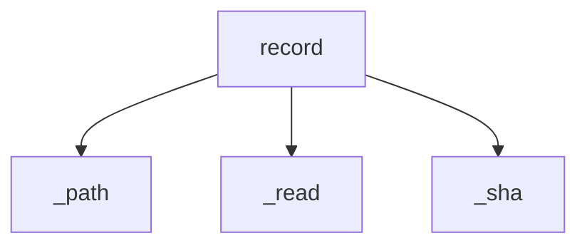

<!-- generated documentation — edit the source, not this file -->
# `src/documate/undo.py`

undo.py — the --ai run manifest, and `documate --undo` to revert it.

Model output is indistinguishable from hand-written prose once it lands, which is
what makes reviewing (and unpicking) a big run slow. Two answers, neither of which
marks the files themselves — nothing documate writes into a repo names the tool:

  record   every --ai run leaves `.documate/last-run.json`: mode, model, which
           file:symbol pairs were drafted, and per touched file the full
           before-text plus a hash of what the run left behind.
  undo     `documate --undo` restores each recorded file's before-text — but only
           when its current content still hashes to what the run left. A file
           edited since is refused, file by file, and stays in the manifest; git
           remains the real undo once drafts are committed, this one works before
           any commit exists.

Records from the same process merge (bare `--ai` chains a seeding pass into a
repair pass — one invocation, one manifest); a new invocation replaces the
manifest, so `--undo` always means "the last `--ai` run". Stdlib only.

**depends on** [`src/documate/core.py`](src.documate.core.md), [`src/documate/ui.py`](src.documate.ui.md)  ·  **used by** [`src/documate/cli.py`](src.documate.cli.md), [`src/documate/prose.py`](src.documate.prose.md)

## API

### `_path(ctx: Context) -> Path`
`src/documate/undo.py:33`

The manifest's home, next to the graph and the briefs.

**called by** `record`, `undo_last`

### `_sha(text: str) -> str`
`src/documate/undo.py:38`

Content hash used to check a file hasn't moved on since the run.

**called by** `record`, `undo_last`

### `_read(ctx: Context, rel: str) -> str`
`src/documate/undo.py:43`

Current content of `rel`, "" when unreadable — matching how a vanished
file diffs against its snapshot.

**called by** `record`, `snapshot`, `undo_last`

### `snapshot(ctx: Context, index: list[dict]) -> dict[str, str]`
`src/documate/undo.py:52`

{rel: content} of every file the run's work orders can touch (the source
file, and the authored page for drift rows), taken before the first model
call — the before-images `record` diffs against.

**calls** `_read`

### `record(ctx: Context, before: dict[str, str], index: list[dict], mode: str, model: str) -> None`
`src/documate/undo.py:65`

Write the run manifest for every snapshotted file the run actually changed;
a run that changed nothing writes nothing (and never clobbers the previous
manifest). A manifest written earlier by this same process is merged into —
bare `--ai` is one invocation in two passes — keeping the older before-images,
which are the true pre-run state.

**calls** `_path`, `_read`, `_sha`

### `undo_last(ctx: Context) -> int`
`src/documate/undo.py:113`

`documate --undo`: restore every file the last --ai run touched to its
before-image — skipping, loudly, any file whose content no longer matches
what the run left (it was edited since; reverting would eat that edit).
Restored files leave the manifest; refused ones stay, so a second --undo
after you've dealt with the edit still works. Nonzero when nothing could
be restored, or anything was refused.

**calls** `_path`, `_read`, `_sha`
